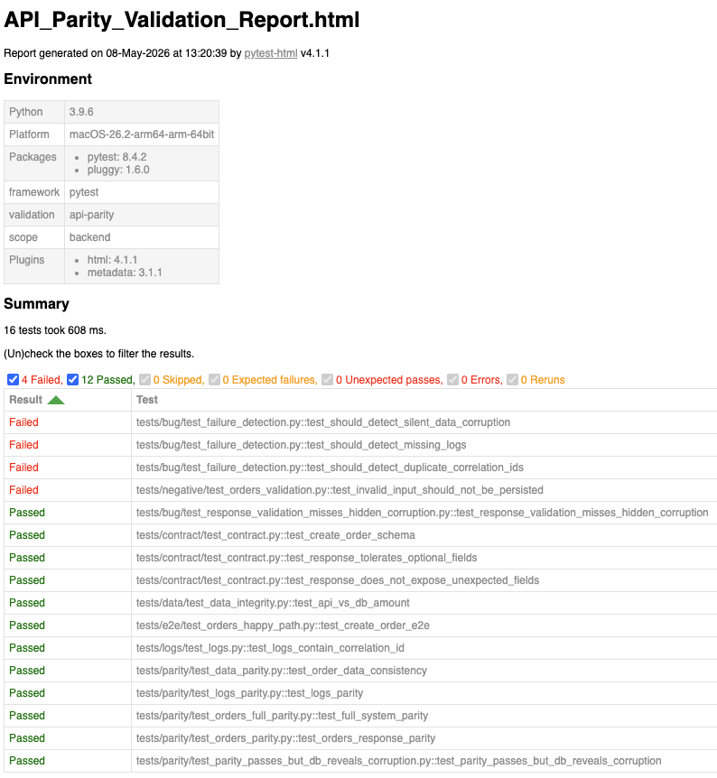

# API Parity QA

## Overview

This project demonstrates how to validate backend systems beyond response-level testing.

The suite validates multiple layers of system behavior, including:
- Response validation
- Contract validation
- Data integrity
- Observability verification
- Parity validation
- Runtime concurrency validation

The goal is to detect failures that traditional API tests often miss.

---

## System Under Test

Target API repository:

```text
https://github.com/mmuller/api-parity-lab
```

The API intentionally exposes controlled failure scenarios designed to simulate realistic backend inconsistencies.

---

## Architecture

```text
                HTTP Request
                      ↓
               API Response

Validation layers:
- Contract validation
- Persistence validation
- Log validation
- Parity validation
- Correlation integrity
```

---

## Quick Start

### Clone repository

```bash
git clone https://github.com/mmuller/api-parity-qa
cd api-parity-qa
```

---

### Setup environment

```bash
python3 -m venv venv
source venv/bin/activate   # Mac/Linux
# venv\Scripts\activate    # Windows

pip install -r requirements.txt
```

---

### Configure target API

```bash
export BASE_URL=http://localhost:8000
```

---

### Execute tests

```bash
pytest
```

---

## Test Structure

```text
tests/
├── contract/     # Schema validation
├── e2e/          # End-to-end validation
├── data/         # Persistence consistency validation
├── logs/         # Observability validation
├── parity/       # Behavioral parity validation
├── negative/     # Invalid input validation
├── bug/          # Failure detection scenarios
```

---

## Core Concept: Parity Validation

Traditional API tests validate isolated responses.

Parity validation verifies that different implementations behave consistently across:
- Responses
- Persistence layers
- Logs
- Operational behavior

This approach allows detection of issues such as:
- Silent data corruption
- Contract drift
- Behavioral inconsistencies
- Observability divergence

Systems may return identical responses while behaving differently internally.

---

## Example Failure Scenarios

### Silent Data Corruption

```python
@pytest.mark.bug
def test_should_detect_silent_data_corruption():
```

Response appears valid while persisted data becomes inconsistent.

---

### Missing Observability Signals

```python
@pytest.mark.bug
def test_should_detect_missing_logs():
```

Operations succeed while critical traceability information is missing.

---

### Concurrency Inconsistencies

```python
@pytest.mark.bug
def test_should_detect_duplicate_correlation_ids():
```

Concurrent execution produces duplicated identifiers and inconsistent traceability.

---

## Example Execution

```bash
pytest tests/contract      # PASS
pytest tests/e2e           # PASS
pytest tests/parity        # FAIL
pytest tests/data          # FAIL
pytest tests/logs          # FAIL
pytest tests/bug           # FAIL
```

Response-level validation may succeed while deeper system validation reveals operational inconsistencies.

---

## Test Reporting

The framework generates self-contained HTML reports using pytest-html to provide visibility into:
- API parity validation
- Contract validation
- Database consistency checks
- Log validation
- Runtime behavior validation
- Silent corruption detection



Generate execution reports:

```bash
pytest --html=reports/report.html --self-contained-html \
       --metadata "env" "local" \
       --metadata "api" "parity-lab"
```

---

## Configuration

Environment variable:

```bash
BASE_URL=http://localhost:8000
```

---

## Tooling

Core stack:
- Python
- pytest
- requests
- jsonschema

Additional tooling:
- pytest-html
- black
- ruff

---

## Why This Matters

Many production defects are not visible at the API surface.

Systems can:
- Return successful responses
- Pass contract validation
- Satisfy schema expectations

...while still generating:
- Incorrect persistence state
- Missing observability data
- Runtime inconsistencies
- Hidden behavioral divergence

This framework focuses on validating those deeper layers.

---

## Real-World Inspiration

Several scenarios in this repository are inspired by real-world migration validation and distributed-system consistency challenges encountered in enterprise environments.

---

## Author

Focus areas:
- Backend validation
- Data integrity verification
- Observability validation
- Parity testing
- Distributed-system behavior analysis
